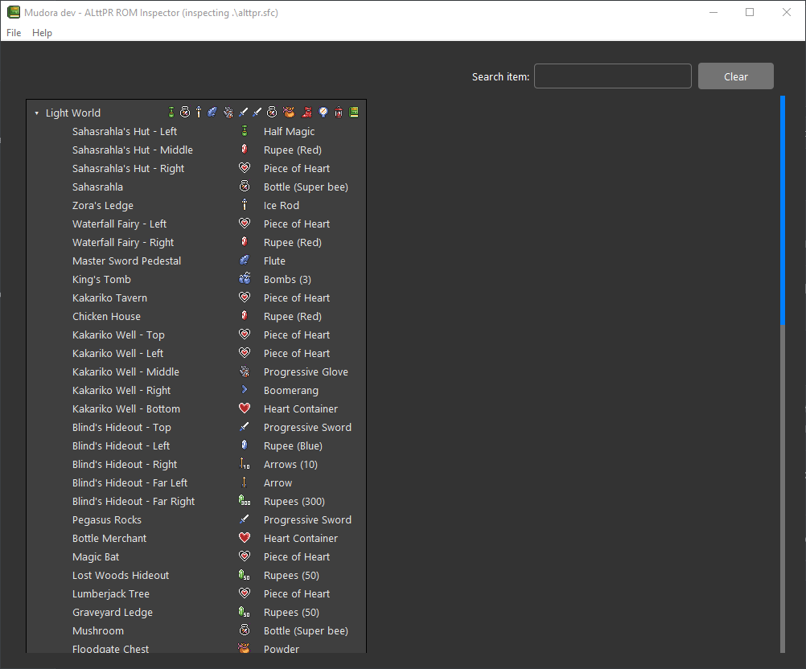

# mudora

<div align="center">
  
  <p>The Book of Mudora</p>

  <p>The monoliths left by the Hylian people are inscribed with ancient script. If you find an inscription you cannot read, use this book and its meaning will become clear.</p>
</div>

mudora is a minimal ALttPR ROM inspection tool. It shows the item locations for a given ROM and can perform item searches if you're stuck.

> [!WARNING]  
> Using this tool to cheat on races makes Link sad. 

# Usage

Run in CLI mode:

```sh
go run mudora <rom.sfc> [item-query]

go run mudora --version
```

Run a GUI:

```sh
go run mudora-gui <rom.sfc>
```

<a href="assets/app.png">
  
</a>

# Contact

Ty Porter

tyler.b.porter@gmail.com
